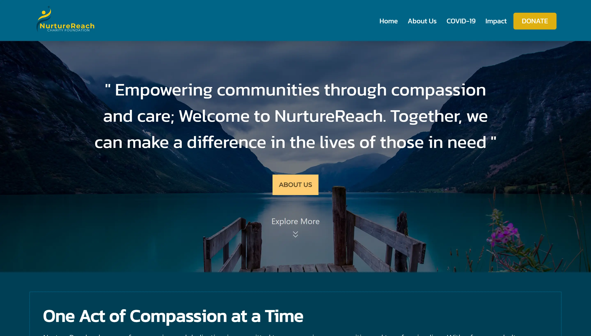

Personal Portfolio:

---

# Personal Portfolio Website

# PLEASE READ THE DISCLAIMER BELOW 👇👇👇

[Disclaimer](./src/components/Privacy/disclaimer.txt)

## Table of Contents

- [Project Overview](#project-overview)
- [Technologies Used](#technologies-used)
- [Project Structure](#project-structure)
- [Contact](#contact)

## Project Overview

Welcome to my NurtureReach, a charity organization website! This project serves as a showcase charity organization dedicated to making a positive impact in communities across the globe.

## Technologies Used

- **Frontend:**
  - React.js: A JavaScript library for building user interfaces.
  - HTML5 & CSS3: Standard web technologies for structuring and styling content.
  - React Router: For handling client-side routing and navigation.
  - React Connect: Redux wrapper for managing state in React apps.
  - React Express: Server-side rendering (SSR) framework for React applications.
  - React Icons: A library for easily adding icons to React apps.
  - React Scroll: Smooth scrolling library for React applications.
  - React Query: Data fetching and state management library for React.
  - React Bootstrap: Bootstrap framework components for React applications.

- **Backend:**
  - Firebase: A comprehensive backend-as-a-service (BaaS) platform provided by Google. It offers services like Realtime Database Firestore, Authentication, Storage, and Cloud Functions.

## Project Structure

The project is structured as follows:

- `public/`: Public assets and the HTML entry point.
- `src/`: Source code of the application.
  - `components/`: React components & Stylesheets for different sections of the website.
  - `db/`: JSON files containing datas.
  - `hooks/`: This directory contains reusable logic and functionality used throughout the application.
  - `index.css/`: Stylesheet for general styling.
  - `App.jsx`: The root component that sets up the application layout and routes.
  - `main.jsx`: The entry point of the React application.

## Contact

- Abayomi Adelakun
- LinkedIn: [LinkedIn](https://www.linkedin.com/in/abayomi-adelakun-897227178/)
- Twitter: [Twitter](https://twitter.com/thisisadelakun)
- Instagram: [Twitter](https://instagram.com/thisisadelakun)

---
